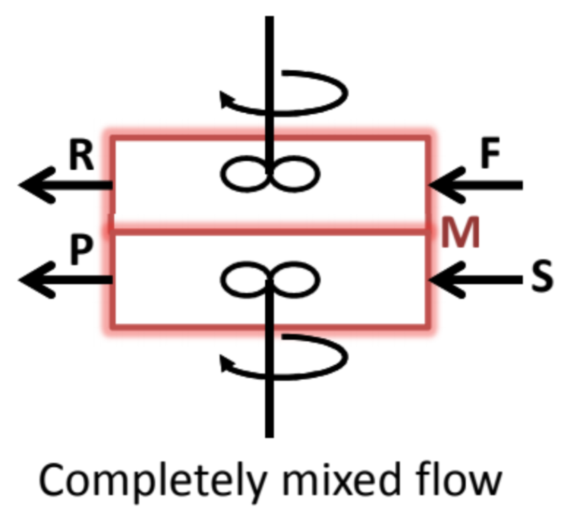
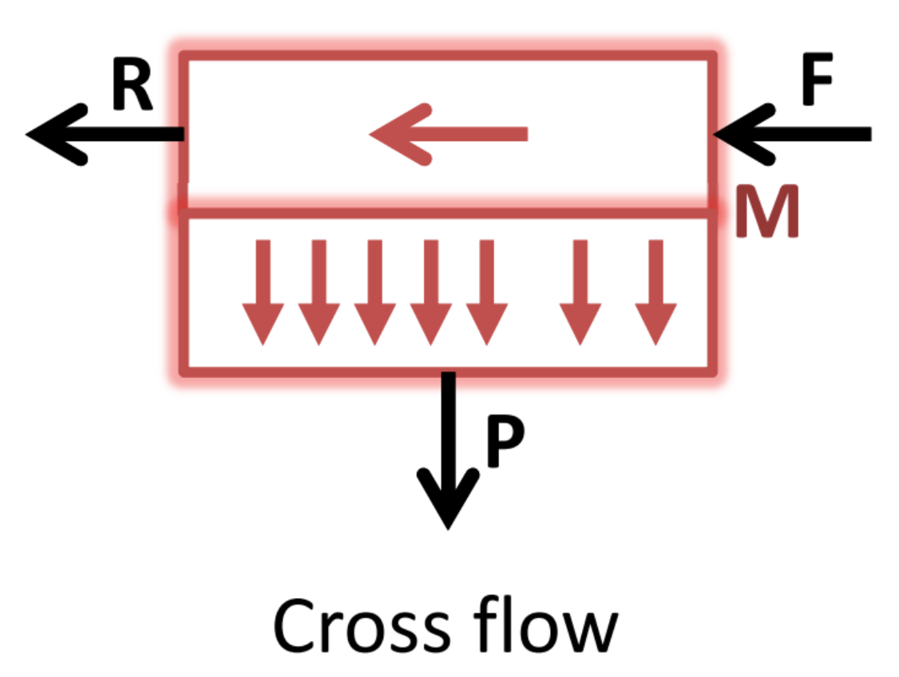
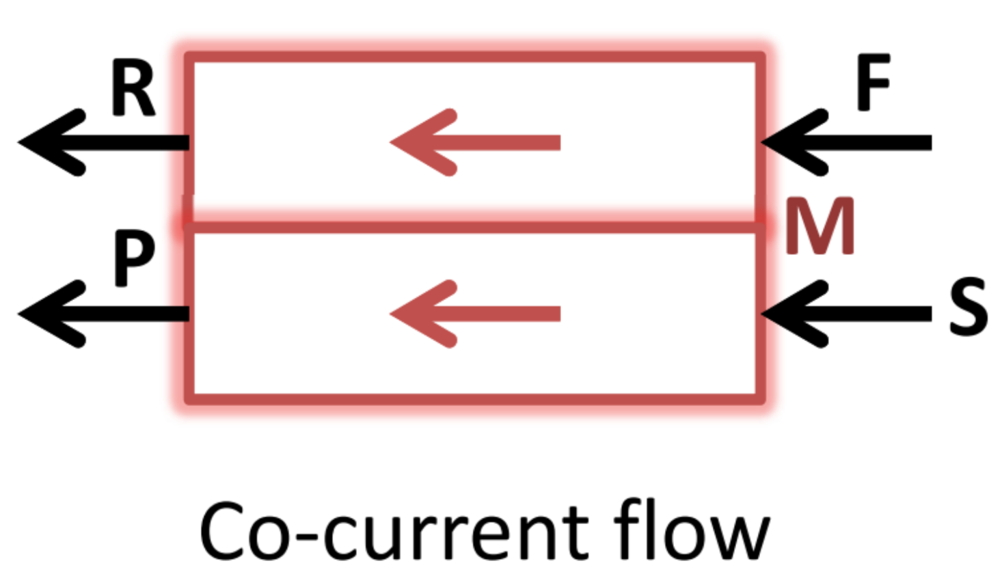
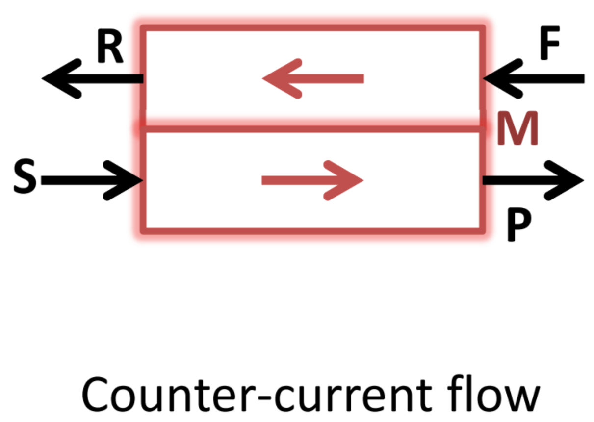

# MEMBRANE SEPARATION MODELING


```python
%reset -f
from IPython.display import display, Math, Latex
import numpy as np
import matplotlib.pyplot as plt
%matplotlib inline
%config InlineBackend.figure_format = 'svg'
import math as m
from scipy.optimize import fsolve
```

## 1. Ideal mixing compartment (binary mixture)

<center></center>

$F^F$ : Molar flowrate at Feed stream, 
$x^F_1$ : Mole fraction of 1 at Feed stream, 
$x^F_2$ : Mole fraction of 2 at Feed stream     

$F^R$ : Molar flowrate at Retentate stream, 
$x^R_1$ : Mole fraction of 1 at Retentate stream, 
$x^R_2$ : Mole fraction of 2 at Retentate stream  

$F^P$ : Molar flowrate at Permeate stream, 
$x^P_1$ : Mole fraction of 1 at Permeate stream, 
$x^P_2$ : Mole fraction of 2 at Permeate stream

$P^R \;,\; P^P$ :Pressure of Retentate and Permeate compartment

$\Pi_1 \;,\; \Pi_2$ :Permeability of 1 and 2

$Am \;,\; \delta$ :Surface area and thickness of membrane.

$\alpha_{1/2} = \frac{\Pi_1}{\Pi_2}$: Separation factor

$\gamma = \frac{P^R}{P^P}$ : Pressure ratio

$\Theta = \frac{F^P}{F^F}$ : Stage cut

\begin{equation}
\left\lbrace \begin{array}{c}
F_1^F -F_1^R -J_1.A_m =0\\
F_2^F -F_2^R -J_2.A_m =0\\
F_1^P -J_1.A_m =0\\
F_2^P -J_2.A_m =0\\
J_1 =\frac{\Pi_1 }{\delta } \left(P^R x_1^R -P^R x_1^R \;\right)\\
J_2 =\frac{\Pi_2 }{\delta } \left(P^R x_2^R -P^R x_2^R \;\right)
\end{array}\iff \left\lbrace \begin{array}{c}
F_1^R =F_1^F -J_1.A_m \\
F_2^R =F_2^F -J_2.A_m \;\\
F_1^P =J_1.A_m \\
F_2^P =J_2.A_m \\
J_1 =\frac{\Pi_1 }{\delta } \left(P^R \frac{F_1^R }{F_1^R +F_2^R }-P^R \frac{F_1^P }{F_1^P +F_2^P }\;\right)\\
J_B =\frac{\Pi_2 }{\delta } \left(P^R \frac{F_2^R }{F_1^R +F_2^R }-P^R \frac{F_2^P }{F_1^P +F_2^P }\;\right)
\end{array}\right.\right.
\end{equation}

The important equation:
\begin{equation}
\frac{x_1^P }{{1-x}_1^P }=\alpha_{1/2} \frac{\left(\gamma x_1^R - x_1^P \;\right)}{\left(\gamma x_2^R - x_2^P\;\right)} (1)
\end{equation}

\begin{equation}
J_1 =\frac{\Pi_1 }{\delta } \left(P^R x_1^R -P^P x_1^P \;\right) (2)
\end{equation}

### Prediction Case

#### You have $A_m$ and calculate $x_i^R,x_i^P,\Theta,F^R,F^P$.

Algorithm:

1) Predict $x_1^R$

2) Solve (1) $\longrightarrow$ $x_1^P$ $\longrightarrow$ $J_1 (2)$ $\longrightarrow$ $(F_1^R = F_1^F - J_1)$$\longrightarrow$$x_1^R$

3) Use new $x_1^R$ and repeat the calculation.


```python
# Exercise 1G
F_F = 0.2*1000;         # [cm3(STP)/s] Molar flowrate of Feed
x1_F = 0.5;             # [...]        Molar fraction of 1 in Feed
x2_F = 1-x1_F;
Pi_1 = 50e-10;
Pi_2 = 5e-10;
t = 25.4*0.0001;        # [cm]         Thickness of membrane
P_R = 800;              # [cmHg]       Retentate pressure
P_P = 20;               # [cmHg]       Permeance pressure
Am = 10 * 10000;        # [cm2]        Area of membrane

x1_R = 0.3;             # Guess

def excercise_1(x):
    a = Pi_1/Pi_2
    g = P_R/P_P
    x2_R = 1-x1_R
    y = (x/(1-x))-a*(g*x1_R - x)/(g*x2_R - (1-x))
    return y

# Molar fraction
for i in range(1000):
    old = x1_R
    x1_P = fsolve(excercise_1,0.5)
    J_1 = Pi_1/t * (P_R * x1_R - P_P * x1_P)
    J_2 = Pi_2/t * (P_R * (1 - x1_R) - P_P*(1 - x1_P))
    F1_R = F_F * x1_F - J_1 * Am 
    F2_R = F_F * x2_F - J_2 * Am
    x1_R = F1_R/(F1_R+F2_R)
    if abs(x1_R-old)<1e-6:
        print('Satisfied !!!')
        break


# Stage cut
Theta = (J_1+J_2)*Am/F_F
display(Math(r'x_1^R = {} \;,\; x_1^P = {} \;,\; \Theta = {}'.
             format(round(x1_R.item(),4), round(x1_P.item(),4), round(Theta.item(),4))))
```

    Satisfied !!!
    


$\displaystyle x_1^R = 0.3495 \;,\; x_1^P = 0.8356 \;,\; \Theta = 0.3096$


```python
# Exercise 2G
F_F = 0.4*1000/60;      # [cm3(STP)/s] Molar flowrate of Feed
x1_F = 0.5;             # [...]        Molar fraction of 1 in Feed
x2_F = 1-x1_F;
Pi_1 = 50e-9;
Pi_2 = 5e-9;
t = 20.4*0.0001;        # [cm]         Thickness of membrane
P_R = 2000;             # [cmHg]       Retentate pressure
P_P = 20;               # [cmHg]       Permeance pressure
Am = 2 * 100;           # [cm2]        Area of membrane

x1_R = 0.256;           # Guess

def excercise_2(x):
    a = Pi_1/Pi_2
    g = P_R/P_P
    x2_R = 1-x1_R
    y = (x/(1-x))-a*(g*x1_R - x)/(g*x2_R - (1-x))
    return y
# Molar fraction
for i in range(1000):
    old = x1_R
    x1_P = fsolve(excercise_2,0.77)
    J_1 = Pi_1/t * (P_R * x1_R - P_P * x1_P)
    J_2 = Pi_2/t * (P_R * (1 - x1_R) - P_P*(1 - x1_P))
    F1_R = F_F * x1_F - J_1 * Am 
    F2_R = F_F * x2_F - J_2 * Am
    x1_R = F1_R/(F1_R+F2_R)
    if abs(x1_R-old)<1e-3:
        print('Satisfied !!!')
        break


# Stage cut
Theta = (J_1+J_2)*Am/F_F
display(Math(r'x_1^R = {} \;,\; x_1^P = {} \;,\; \Theta = {}'.
             format(round(x1_R.item(),4), round(x1_P.item(),4), round(Theta.item(),4))))
```

    Satisfied !!!
    


$\displaystyle x_1^R = 0.2565 \;,\; x_1^P = 0.77 \;,\; \Theta = 0.4742$


### Design Case
#### 1. You have $x_i^R$ and calculate $A_m , x_i^P$.
Algorithm:

1. Solve (1) $\longrightarrow$ $x_1^P$

2. $x_1^P,x_1^R$ $\longrightarrow$ $F^P,F^R$

3. $x_1^P, F^P$ $\longrightarrow$ $J_1$ $\longrightarrow$ $A_m$

for step 2, use : $$F^P = F^F \times \frac{x_1^F - x_1^R}{x_1^P - x_1^R}\;,\; F^R = F^F - F^P$$

**REMEMBER**

$1\;\mathrm{barrel}={10}^{-10} \frac{{\mathrm{cm}}^3 \left(\mathrm{STP}\right)\ldotp \mathrm{cm}}{{\mathrm{cm}}^2 \ldotp s\ldotp \mathrm{cmHg}}$


```python
# Exercise 3G
F_F = 3;                # [m3(STP)/min] Molar flowrate of Feed
x1_F = 0.3;             # [...]        Molar fraction of 1 in Feed
x2_F = 1-x1_F;
Pi_1 = 254;             # [barrer]
Pi_2 = 8.5;             # [barrer]
t = 15*0.0001;          # [cm]        Thickness of membrane
P_R = 20;               # [bar]       Retentate pressure
P_P = 1;                # [bar]       Permeance pressure
x1_R = x1_F/2;          # [...]       Mole fraction retentate

# Molar fraction
def excercise_3(x):
    a = Pi_1/Pi_2
    g = P_R/P_P
    x2_R = 1-x1_R
    y = (x/(1-x))-a*(g*x1_R - x)/(g*x2_R - (1-x))
    return y

x1_P = fsolve(excercise_3,0.5)
display(Math(r'x_1^P = {}'.format(round(x1_P.item(),4))))

# Change the unit;
F_F = 3*1e6/60;             # [cm3(STP)/s] Molar flowrate of Feed
Pi_1 = 254*10**-10;         # [cm3(STP).cm/cm2.cmHg]
Pi_2 = 8.5*10**-10;         # [cm3(STP).cm/cm2.cmHg]
P_R = 20*75.006;            # [cmHg]       Retentate pressure
P_P = 1*75.006;             # [cmHg]       Permeance pressure


# Stage cut
F_P = F_F*(x1_F-x1_R)/(x1_P-x1_R)
Theta = F_P/F_F
display(Math(r'\Theta = {}'.format(round(Theta.item(),4))))

# Membrane Area
J_1 = Pi_1/t * (P_R * x1_R - P_P * x1_P)
Am = (F_P * x1_P / J_1)*0.0001

display(Math(r'A_m = {} \;m^2'.format(round(Am.item(),2))))

```


$\displaystyle x_1^P = 0.7967$


$\displaystyle \Theta = 0.2319$


$\displaystyle A_m = 330.17 \;m^2$


#### 2. You have $x_i^P$ and calculate $A_m , x_i^R$.

Algorithm:

1. Solve (1) $\longrightarrow$ $x_1^R$

2. $x_1^P,x_1^R$ $\longrightarrow$ $F^P,F^R$

3. $x_1^P, F^P$ $\longrightarrow$ $J_1$ $\longrightarrow$ $A_m$

for step 2, use : $$F^P = F^F \times \frac{x_1^F - x_1^R}{x_1^P - x_1^R}\;,\; F^R = F^F - F^P$$


```python
# Exercise 6G
F_F = 1;                # [m3(STP)/min] Molar flowrate of Feed
x1_F = 0.21;            # [...]        Molar fraction of 1 in Feed
x2_F = 1-x1_F;
Pi_1 = 90;              # [barrer]
Pi_2 = 4.5;             # [barrer]
t = 30*0.0001;          # [cm]        Thickness of membrane
P_R = 30 ;              # [bar]       Retentate pressure
P_P = 1;                # [bar]       Permeance pressure
x1_P = 0.6;             # [...]       Mole fraction permeate

# Molar fraction
def excercise_6(x):
    a = Pi_1/Pi_2
    g = P_R/P_P
    x2_P = 1-x1_P
    y = (x1_P/(1-x1_P))-a*(g*x - x1_P)/(g*(1-x) - x2_P)
    return y

x1_R = fsolve(excercise_6,0.5)
display(Math(r'x_1^R = {}'.format(round(x1_R.item(),4))))

# Change the unit;
F_F = 1*1e6/60;             # [cm3(STP)/s] Molar flowrate of Feed
Pi_1 = 90*10**-10;          # [cm3(STP).cm/cm2.cmHg]
Pi_2 = 4.5*10**-10;         # [cm3(STP).cm/cm2.cmHg]
P_R = 30*75.006;            # [cmHg]       Retentate pressure
P_P = 1*75.006;             # [cmHg]       Permeance pressure

# Stage cut
F_P = F_F*(x1_F-x1_R)/(x1_P-x1_R)
Theta = F_P/F_F
display(Math(r'\Theta = {}'.format(round(Theta.item(),4))))

# Membrane Area
J_1 = Pi_1/t * (P_R * x1_R - P_P * x1_P)
Am = (F_P * x1_P / J_1)*0.0001

display(Math(r'A_m = {} \;m^2'.format(round(Am.item(),2))))
```


$\displaystyle x_1^R = 0.0874$


$\displaystyle \Theta = 0.2391$


$\displaystyle A_m = 525.21 \;m^2$


#### 3. You have $\Theta$ and calculate $A_m , x_i^R,x_i^P$.

We have the relation: $$F^P = F^F \times \frac{x_1^F - x_1^R}{x_1^P - x_1^R}$$
$$\Theta = \frac{x_1^F - x_1^R}{x_1^P - x_1^R}$$
And we have:
$$x_1^R = \frac{x_1^F -{\Theta x}_1^P }{\left(1-\Theta \right)}$$
Subtitute the above equation to equation (1):
$$\frac{x_1^P }{{1-x}_1^P }=\alpha_{1/2} \frac{\left(\gamma \left\lbrack \frac{x_1^F -{\Theta x}_1^P }{\left(1-\Theta \right)}\right\rbrack - x_1^P \;\right)}{\left(\gamma \left\lbrack 1-\frac{x_1^F -{\Theta x}_1^P }{\left(1-\Theta \right)}\right\rbrack - \left({1-x}_1^P \right)\;\right)}(3)$$ 

Algorithm:

1. Solve (3) $\longrightarrow$ $x_1^P$ $\longrightarrow$ $x_1^R$

2. $\Theta$ $\longrightarrow$ $F^P,F^R$

3. $x_1^P, F^P$ $\longrightarrow$ $J_1$ $\longrightarrow$ $A_m$


```python
# Excercise 4G
F_F = 1*1e6/60;             # [cm3(STP)/s] Molar flowrate of Feed
t = 25*0.0001;          # [cm]        Thickness of membrane
Pi_1 = 55*10**-10;          # [cm3(STP).cm/cm2.cmHg]
Pi_2 = 55/9.8*10**-10;         # [cm3(STP).cm/cm2.cmHg]
P_R = 20*75.006;            # [cmHg]       Retentate pressure
P_P = 1*75.006;             # [cmHg]       Permeance pressure
x1_F = 0.21;             # [...]       Mole fraction feed
Theta = 0.25             # Stage cut


def excercise_4(x):
    a = Pi_1/Pi_2
    g = P_R/P_P
    x1_R = (x1_F-Theta*x)/(1-Theta)
    x2_R = 1-x1_R
    y = (x/(1-x))-a*(g*x1_R - x)/(g*x2_R - (1-x))
    return y

x1_P = fsolve(excercise_4,0.5)
display(Math(r'x_1^P = {}'.format(round(x1_P.item(),4))))

x1_R = (x1_F-Theta*x1_P)/(1-Theta)
display(Math(r'x_1^R = {}'.format(round(x1_R.item(),4))))

# Membrane Area
J_1 = Pi_1/t * (P_R * x1_R - P_P * x1_P)
F_P = F_F * Theta
Am = (F_P * x1_P / J_1)*0.0001

display(Math(r'A_m = {} \;m^2'.format(round(Am.item(),2))))
```


$\displaystyle x_1^P = 0.5005$


$\displaystyle x_1^R = 0.1132$


$\displaystyle A_m = 717.03 \;m^2$


```python
# Excercise 5G
F_F = 1*1e6/60;             # [cm3(STP)/s] Molar flowrate of Feed
t = 30*0.0001;          # [cm]        Thickness of membrane
Pi_1 = 70*10**-10;          # [cm3(STP).cm/cm2.cmHg]
Pi_2 = 11.5*10**-10;         # [cm3(STP).cm/cm2.cmHg]
P_R = 20*75.006;            # [cmHg]       Retentate pressure
P_P = 1*75.006;             # [cmHg]       Permeance pressure
x1_F = 0.21;             # [...]       Mole fraction feed
Theta = 0.15             # Stage cut


def excercise_5(x):
    a = Pi_1/Pi_2
    g = P_R/P_P
    x1_R = (x1_F-Theta*x)/(1-Theta)
    x2_R = 1-x1_R
    y = (x/(1-x))-a*(g*x1_R - x)/(g*x2_R - (1-x))
    return y

x1_P = fsolve(excercise_5,0.5)
display(Math(r'x_1^P = {}'.format(round(x1_P.item(),4))))

x1_R = (x1_F-Theta*x1_P)/(1-Theta)
display(Math(r'x_1^R = {}'.format(round(x1_R.item(),4))))

# Membrane Area
J_1 = Pi_1/t * (P_R * x1_R - P_P * x1_P)
F_P = F_F * Theta
Am = (F_P * x1_P / J_1)*0.0001

display(Math(r'A_m = {} \;m^2'.format(round(Am.item(),2))))
```


$\displaystyle x_1^P = 0.4997$


$\displaystyle x_1^R = 0.1589$


$\displaystyle A_m = 266.53 \;m^2$


### Limit Case

**a) Find the minimum concentration of retentate stream ($A_m$ is significant small)**
1. Assume $x_i^P = x_i^F$
2. Solve (1) $\longrightarrow$ $x_{i,min}^R$

**b) Find the maximum concentration of permeate stream ($A_m$ is significant large)**
1. Assume $x_i^R = x_i^F$
2. Solve (1) $\longrightarrow$ $x_{i,max}^P$


```python
# Excersise 6G - Limit
F_F = 1*1e6/60;             # [cm3(STP)/s] Molar flowrate of Feed
Pi_1 = 90*10**-10;          # [cm3(STP).cm/cm2.cmHg]
Pi_2 = 4.5*10**-10;         # [cm3(STP).cm/cm2.cmHg]
P_R = 30*75.006;            # [cmHg]       Retentate pressure
P_P = 1*75.006;             # [cmHg]       Permeance pressure
x1_F = 0.21;                # [...]        Molar fraction of 1 in Feed
x2_F = 1-x1_F;
t = 30*0.0001;              # [cm]        Thickness of membrane

def excercise_6_limit_per(x):
    a = Pi_1/Pi_2
    g = P_R/P_P
    x2_R = 1-x1_R
    y = (x/(1-x))-a*(g*x1_R - x)/(g*x2_R - (1-x))
    return y

def excercise_6_limit_ret(x):
    a = Pi_1/Pi_2
    g = P_R/P_P
    x2_P = 1-x1_P
    y = (x1_P/(1-x1_P))-a*(g*x - x1_P)/(g*(1-x) - x2_P)
    return y

# For minimum concentration of retentate
x1_P = x1_F
x1_R_min = fsolve(excercise_6_limit_ret,0.5)
display(Math(r'min\; x_1^R = {}'.format(round(x1_R_min.item(),4))))

# For maximum concentration of permeate
x1_R = x1_F
x1_P_max = fsolve(excercise_6_limit_per,0.5)
display(Math(r'max\; x_1^P = {}'.format(round(x1_P_max.item(),4))))
```


$\displaystyle min\; x_1^R = 0.0197$


$\displaystyle max\; x_1^P = 0.8232$


### Sensitivity Analysis
<p style='text-align: justify;'>
Assume the separation of air and calculate the composition of retentate and permeate as a function of
pressure ratio between retentate and permeate side, the selectivity of the membrane, and stage cut.
Assume that both compartments are ideally mixed and molar fraction of oxygen in feed 0.21.
</p>

Use the equation (3):
$$\frac{x_1^P }{{1-x}_1^P }=\alpha_{1/2} \frac{\left(\gamma \left\lbrack \frac{x_1^F -{\Theta x}_1^P }{\left(1-\Theta \right)}\right\rbrack - x_1^P \;\right)}{\left(\gamma \left\lbrack 1-\frac{x_1^F -{\Theta x}_1^P }{\left(1-\Theta \right)}\right\rbrack - \left({1-x}_1^P \right)\;\right)}(3)$$ 

First we study the effect of $\alpha_{1/2}$ on $x_i^R, x_i^P$ with $\gamma = 30, x_1^F = 0.21$


```python
# Excercise G7-Limit-Case 1
a = np.array([5,10,25,75,250])
Theta = np.linspace(0,0.95,100)
g = 30
x1_F = 0.21
def excercise_7_limit(x):
    x1_R = (x1_F - Theta_i*x)/(1-Theta_i)
    x2_R = 1 - x1_R
    y = (x/(1-x))-a_i*(g*x1_R - x)/(g_i*x2_R - (1-x))
    return y

x1_P_f = np.zeros(len(Theta))
for i in range(len(a)):
    a_i = a[i]
    g_i = g
    x1_P = np.zeros(0)
    for j in range(len(Theta)):
        Theta_i = Theta[j]
        x1_P = np.hstack([x1_P,fsolve(excercise_7_limit,0.99)])
    x1_P_f = np.vstack([x1_P_f,x1_P])

x1_P_f = np.delete(x1_P_f, 0, 0)
for i in range(len(a)):
    plt.plot(Theta,x1_P_f[i,:],label='$α_{1/2}$= '+str(a[i]))

plt.xlim(0,0.95)
plt.ylim(0,1)
plt.xlabel('$\Theta$')
plt.ylabel('$x_1^P$')
plt.title('Effect of $α_{1/2}$  ($p_R/p_P$=30, $x_1^F$= 0.21)')
plt.legend(loc="best")
```


    <matplotlib.legend.Legend at 0x26dbb36a240>


```python
# Excercise G7-Limit-Case 2
g = np.array([2,5,10,30,100])
Theta = np.linspace(0,0.95,100)
a = 25
x1_F = 0.21

def excercise_7_limit(x):
    x1_R = (x1_F - Theta_i*x)/(1-Theta_i)
    x2_R = 1 - x1_R
    y = (x/(1-x))-a*(g_i*x1_R - x)/(g_i*x2_R - (1-x))
    return y
x1_P_f = np.zeros(len(Theta))
for i in range(len(g)):
    g_i = g[i]
    x1_P = np.zeros(0)
    for j in range(len(Theta)):
        Theta_i = Theta[j]
        x1_P = np.hstack([x1_P,fsolve(excercise_7_limit,0.99)])
    x1_P_f = np.vstack([x1_P_f,x1_P])

x1_P_f = np.delete(x1_P_f, 0, 0)
for i in range(len(g)):
    plt.plot(Theta,x1_P_f[i,:],label='$p_R/p_P$ =' + str(g[i]))

plt.xlim(0,0.95)
plt.ylim(0,1)
plt.xlabel('$\Theta$')
plt.ylabel('$x_1^P$')
plt.title('Effect of $p_R/p_P$ ($α_{1/2}$=25, $x_1^F$= 0.21)')
plt.legend(loc="best")
```


    <matplotlib.legend.Legend at 0x26dba8b14e0>


## 2. Cross Flow (Binary Mixture)

<center></center>

#### You have $A_m$ and calculate $x_i^R,x_i^P,\Theta,F^R,F^P$.

Mass balance equation in retentate:
$$
\left\lbrace \begin{array}{c}
\frac{{\mathrm{dF}}_1^R }{{\mathrm{dA}}_m }={-\;J}_1 \\
\frac{{\mathrm{dF}}_2^R }{{\mathrm{dA}}_m }={-\;J}_2 \\
J_1 =\frac{\Pi_1 }{\delta }\left(P^R x_1^R -P^P \frac{J_1 }{J_1 +J_2 }\right)\\
J_2 =\frac{\Pi_2 }{\delta }\left(P^R x_2^R -P^P \frac{J_2 }{J_1 +J_2 }\right)
\end{array}\right.\Rightarrow \left\lbrace \begin{array}{c}
\frac{{\mathrm{dF}}_1^R }{{\mathrm{dA}}_m }={-\;J}_1 \\
\frac{{\mathrm{dF}}_2^R }{{\mathrm{dA}}_m }={-\;J}_2 \\
\frac{x_1^P }{{1-x}_1^P }=\alpha_{A/B} \frac{\left(\gamma \;\ldotp x_1^R -x_1^P \;\right)}{\left(\gamma \;\ldotp x_2^R -x_2^P \;\right)}\\
J_1 =\frac{\Pi_1 }{\delta }\left(P^R x_1^R -P^P x_1^P \right)\\
J_2 =\frac{\Pi_2 }{\delta }\left(P^R x_2^R -P^P x_2^P \right)
\end{array}\right.
$$

Algorithm:
1. Use Euler method which initial condition is $F_1^R(A_m = 0) = F_F.x_1^F$ and $F_2^R(A_m = 0) = F_F.x_2^F$

2. Use $x_1^R(0) = x_1^F,x_2^R(0) = x_2^F \longrightarrow$ Solve(1) $\longrightarrow x_1^P, x_2^P$ 

3. From $x_1^P, x_2^P$ use equation (2) $\longrightarrow J_1,J_2$ 

4. From $J_1,J_2$ use Euler method to calculate the $F_1^R,F_2^R$ in next $\Delta A_m$ step

5. From $F_1^R,F_2^R$ $\longrightarrow x_1^R,x_2^R$ repeat step 2


```python
# Excersise 8G
AmT = 250*1e4;              # [cm2] Membrane area
F_F = 1*1e6/60;             # [m3(STP)/min] air flow rate
t = 30*0.0001;              # [cm] Thickness of membrane
Pi_1 = 70*10**-10;          # [cm3(STP).cm/cm2.cmHg]
Pi_2 = 11.5*10**-10;        # [cm3(STP).cm/cm2.cmHg]
P_R = 20*75.006;            # [cmHg]       Retentate pressure
P_P = 1*75.006;             # [cmHg]       Permeance pressure
x1_F = 0.21                 # Mole fraction of feed oxygen

# Non linear function
def excercise_8(x):
    a = Pi_1/Pi_2
    g = P_R/P_P
    x2_R = 1-x1_R
    y = (x/(1-x))-a*(g*x1_R - x)/(g*x2_R - (1-x))
    return y

# Euler Solver:
dA = 10000                  # [m2] area step
F1_R0 = F_F*x1_F;           # Initial value
F2_R0 = F_F*(1-x1_F)        # Initial value
n = int(AmT/dA)+1           # Number of point
F1_R = np.zeros(n)
F2_R = np.zeros(n)
Am = np.zeros(n)
F1_R[0] = F1_R0
F2_R[0] = F2_R0
x_R = np.zeros(0)
x_P = np.zeros(0)
for i in range(1,n):
    x1_R = F1_R[i-1]/(F1_R[i-1]+F2_R[i-1])
    x_R = np.hstack([x_R,x1_R])
    x1_P = fsolve(excercise_8,0.9)
    x_P = np.hstack([x_P,x1_P])
    J_1 = Pi_1/t * (P_R * x1_R - P_P * x1_P)
    J_2 = Pi_2/t * (P_R * (1-x1_R) - P_P * (1-x1_P))
    F1_R[i] = F1_R[i-1] - J_1*dA
    F2_R[i] = F2_R[i-1] - J_2*dA
    Am[i] = Am[i-1] + dA
    
# Update final mole fraction
x1_R = F1_R[n-1]/(F1_R[n-1]+F2_R[n-1])
x_R = np.hstack([x_R,x1_R])
x1_P = fsolve(excercise_8,0.9)
x_P = np.hstack([x_P,x1_P])

# Result
display(Math(r'x_1^R = {}'.format(round(x1_R.item(),4))))
display(Math(r'x_1^P = {}'.format(round(x1_P.item(),4))))
# Stage cut
F_P = F_F - (F1_R[n-1]+F2_R[n-1])
Theta = F_P/F_F
display(Math(r'\Theta = {}'.format(round(Theta.item(),4))))

plt.grid('on')
plt.plot(Am/1e4,x_R,'b--',label='$x_1^R$')
plt.plot(Am/1e4,x_P,'b',label='$x_1^P$')
plt.plot(Am/1e4,(1-x_R),'r--',label='$x_2^R$')
plt.plot(Am/1e4,(1-x_P),'r',label='$x_2^P$')
plt.xlim([0,250])
plt.ylim([0,0.9])
plt.legend(loc="upper right")
plt.xlabel('$A_m$ / $m^2$')
plt.ylabel('Molar Fraction')

```


$\displaystyle x_1^R = 0.152$


$\displaystyle x_1^P = 0.486$


$\displaystyle \Theta = 0.1494$


    Text(0, 0.5, 'Molar Fraction')


## 3. Co-current Flow (Binary Mixture)

<center></center>

#### You have $A_m$ and calculate $x_i^R,x_i^P,\Theta,F^R,F^P$.

Mass balance equation in retentate and permeate:

$$\left\lbrace \begin{array}{c}
\frac{{\mathrm{dF}}_1^R }{{\mathrm{dA}}_m }={-\;J}_1 \;,\;\;\frac{{\mathrm{dF}}_2^R }{{\mathrm{dA}}_m }={-\;J}_2 \\
\frac{{\mathrm{dF}}_1^P }{{\mathrm{dA}}_m }={\;J}_1 \;,\;\;\frac{{\mathrm{dF}}_2^P }{{\mathrm{dA}}_m }={\;J}_2 \\
J_1 =\frac{\Pi_1 }{\delta }\left(P^R x_1^R -P^P \frac{J_1 }{J_1 +J_2 }\right)\\
J_2 =\frac{\Pi_2 }{\delta }\left(P^R x_2^R -P^P \frac{J_2 }{J_1 +J_2 }\right)
\end{array}\right.\Rightarrow \left\lbrace \begin{array}{c}
\frac{{\mathrm{dF}}_1^R }{{\mathrm{dA}}_m }=-\frac{\Pi_1 }{\delta }\left(P^R \frac{F_1^R }{F_1^R +F_2^R }-P^P \frac{F_1^P }{F_1^P +F_2^P }\right)\;\\
\frac{{\mathrm{dF}}_1^P }{{\mathrm{dA}}_m }=\frac{\Pi_1 }{\delta }\left(P^R \frac{F_1^R }{F_1^R +F_2^R }-P^P \frac{F_1^P }{F_1^P +F_2^P }\right)\\
\frac{{\mathrm{dF}}_2^R }{{\mathrm{dA}}_m }=-\frac{\Pi_2 }{\delta }\left(P^R \frac{F_2^R }{F_1^R +F_2^R }-P^P \frac{F_2^P }{F_1^P +F_2^P }\right)\\
\frac{{\mathrm{dF}}_2^P }{{\mathrm{dA}}_m }=\frac{\Pi_2 }{\delta }\left(P^R \frac{F_2^R }{F_1^R +F_2^R }-P^P \frac{F_2^P }{F_1^P +F_2^P }\right)
\end{array}\right.$$

Solve the system of ODEs with those initial condition:

1. $F_1^R(A_m = 0) = F_F.x_1^F$ and $F_2^R(A_m = 0) = F_F.x_2^F$

2. Use $x_1^R(0) = x_1^F,x_2^R(0) = x_2^F \longrightarrow$ Solve(1) $\longrightarrow x_1^P, x_2^P$ Use (2) $\longrightarrow J_1,J_2$ 

3. $F_1^P(A_m = 0) = J_1$ and $F_2^P(A_m = 0) = J_2$


```python
# Excercise 9G
AmT = 250*1e4;              # [cm2] Membrane area
F_F = 1*1e6/60;             # [m3(STP)/min] air flow rate
t = 30*0.0001;              # [cm] Thickness of membrane
Pi_1 = 70*10**-10;          # [cm3(STP).cm/cm2.cmHg]
Pi_2 = 11.5*10**-10;        # [cm3(STP).cm/cm2.cmHg]
P_R = 20*75.006;            # [cmHg]       Retentate pressure
P_P = 1*75.006;             # [cmHg]       Permeance pressure
x1_F = 0.21                 # Mole fraction of feed oxygen

# Non linear function
def excercise_9(x):
    a = Pi_1/Pi_2
    g = P_R/P_P
    x2_R = 1-x1_R
    y = (x/(1-x))-a*(g*x1_R - x)/(g*x2_R - (1-x))
    return y

# Euler Solver:
dA = 10000                  # [m2] area step
F1_R0 = F_F*x1_F;           # Initial value
F2_R0 = F_F*(1-x1_F)        # Initial value
n = int(AmT/dA)+1           # Number of point

# Initial value
F1_R = np.zeros(n)
F1_R[0] = F1_R0

F2_R = np.zeros(n)
F2_R[0] = F2_R0

F1_P = np.zeros(n)
x1_R = x1_F
x1_P0 = fsolve(excercise_9,0.9)
J_1 = Pi_1/t * (P_R * x1_R - P_P * x1_P0)
F1_P[0] = J_1

F2_P = np.zeros(n)
J_2 = Pi_2/t * (P_R * (1 - x1_R) - P_P * (1 - x1_P0))
F2_P[0] = J_2

Am = np.zeros(n)

for i in range(1,n):
    x1_R = F1_R[i-1]/(F1_R[i-1]+F2_R[i-1])
    x1_P = F1_P[i-1]/(F1_P[i-1]+F2_P[i-1])
    J_1 = Pi_1/t * (P_R * x1_R - P_P * x1_P)
    J_2 = Pi_2/t * (P_R * (1 - x1_R) - P_P * (1 - x1_P))
    F1_R[i] = F1_R[i-1] - J_1*dA
    F2_R[i] = F2_R[i-1] - J_2*dA
    F1_P[i] = F1_P[i-1] + J_1*dA
    F2_P[i] = F2_P[i-1] + J_2*dA
    Am[i] = Am[i-1] + dA
    
x_R = F1_R/(F1_R + F2_R)
x_P = F1_P/(F1_P + F2_P)

# Result
display(Math(r'x_1^R = {}'.format(round(x_R[n-1].item(),4))))
display(Math(r'x_1^P = {}'.format(round(x_P[n-1].item(),6))))
# Stage cut
F_P = F_F - (F1_R[n-1]+F2_R[n-1])
Theta = F_P/F_F
display(Math(r'\Theta = {}'.format(round(Theta.item(),6))))

plt.grid('on')
plt.plot(Am/1e4,x_R,'b--',label='$x_1^R$')
plt.plot(Am/1e4,x_P,'b',label='$x_1^P$')
plt.plot(Am/1e4,(1-x_R),'r--',label='$x_2^R$')
plt.plot(Am/1e4,(1-x_P),'r',label='$x_2^P$')
plt.xlim([0,250])
plt.ylim([0,0.9])
plt.legend(loc="upper right")
plt.xlabel('$A_m$ / $m^2$')
plt.ylabel('Molar Fraction')
```


$\displaystyle x_1^R = 0.1526$


$\displaystyle x_1^P = 0.538028$


$\displaystyle \Theta = 0.148891$


    Text(0, 0.5, 'Molar Fraction')


## 3. Counter-current Flow (Binary Mixture)

<center></center>

#### You have $A_m$ and calculate $x_i^R,x_i^P,\Theta,F^R,F^P$.

Mass balance equation in retentate and permeate:

$$
\left\lbrace \begin{array}{c}
\frac{{\mathrm{dF}}_1^R }{{\mathrm{dA}}_m }={-\;J}_1 \;,\;\;\frac{{\mathrm{dF}}_2^R }{{\mathrm{dA}}_m }={-\;J}_2 \\
\frac{{\mathrm{dF}}_1^P }{{\mathrm{dA}}_m }={\;-J}_1 \;,\;\;\frac{{\mathrm{dF}}_2^P }{{\mathrm{dA}}_m }={\;-J}_2 \\
J_1 =\frac{\Pi_1 }{\delta }\left(P^R x_1^R -P^P \frac{J_1 }{J_1 +J_2 }\right)\\
J_2 =\frac{\Pi_2 }{\delta }\left(P^R x_2^R -P^P \frac{J_2 }{J_1 +J_2 }\right)
\end{array}\Rightarrow \left\lbrace \begin{array}{c}
\frac{{\mathrm{dF}}_1^R }{{\mathrm{dA}}_m }=-\frac{\Pi_1 }{\delta }\left(P^R \frac{F_1^R }{F_1^R +F_2^R }-P^P \frac{F_1^P }{F_1^P +F_2^P }\right)\;\\
\frac{{\mathrm{dF}}_1^P }{{\mathrm{dA}}_m }=-\frac{\Pi_1 }{\delta }\left(P^R \frac{F_1^R }{F_1^R +F_2^R }-P^P \frac{F_1^P }{F_1^P +F_2^P }\right)\\
\frac{{\mathrm{dF}}_2^R }{{\mathrm{dA}}_m }=-\frac{\Pi_2 }{\delta }\left(P^R \frac{F_2^R }{F_1^R +F_2^R }-P^P \frac{F_2^P }{F_1^P +F_2^P }\right)\\
\frac{{\mathrm{dF}}_2^P }{{\mathrm{dA}}_m }=-\frac{\Pi_2 }{\delta }\left(P^R \frac{F_2^R }{F_1^R +F_2^R }-P^P \frac{F_2^P }{F_1^P +F_2^P }\right)
\end{array}\right.\right.
$$

BUT, we have boundary value problem:

$F_1^R(0) = F_F.x_1^F,\;F_2^R(0) = F_F.x_2^F$

$F_1^P(A_{total}) = J_1,\;F_2^P(A_{total}) = J_2$

Using shooting method, reducing the bondary value problem to initial value problem:

1. Guess $x_1^R,x_2^R$ and $F_R$ at $A_{total}$

2. Solve initial condition from $A_{total} \longrightarrow 0 $

3. Compare $x_1^R(0)$ with $x_1^F$, $F_R(0)$ with $F_F$

4. Guessing until $x_1^R(0)$ = $x_1^F$, $F_R(0)$ = $F_F$, by using interpolate or solving nonlinear equation


```python
# Excersise 10G:
AmT = 250*1e4;              # [cm2] Membrane area
F_F = 1*1e6/60;             # [m3(STP)/min] air flow rate
t = 30*0.0001;              # [cm] Thickness of membrane
Pi_1 = 70*10**-10;          # [cm3(STP).cm/cm2.cmHg]
Pi_2 = 11.5*10**-10;        # [cm3(STP).cm/cm2.cmHg]
P_R = 20*75.006;            # [cmHg] Retentate pressure
P_P = 1*75.006;             # [cmHg] Permeance pressure
F_F_final = 14171.98


def shooting(x):
    x1_F = x                # Mole fraction of feed oxygen [Guess]
    
    # Non linear function
    def excercise_10(x):
        a = Pi_1/Pi_2
        g = P_R/P_P
        x2_R = 1-x1_R
        y = (x/(1-x))-a*(g*x1_R - x)/(g*x2_R - (1-x))
        return y
    
    # Euler Solver:
    dA = 10000                  # [m2] area step
    F1_R0 = F_F_final*x1_F;           # Initial value
    F2_R0 = F_F_final*(1-x1_F)        # Initial value
    n = int(AmT/dA)+1           # Number of point

    # Initial value
    F1_R = np.zeros(n)
    F1_R[0] = F1_R0

    F2_R = np.zeros(n)
    F2_R[0] = F2_R0

    F1_P = np.zeros(n)
    x1_R = x1_F
    x1_P0 = fsolve(excercise_10,0.9)
    J_1 = Pi_1/t * (P_R * x1_R - P_P * x1_P0)
    F1_P[0] = J_1

    F2_P = np.zeros(n)
    J_2 = Pi_2/t * (P_R * (1 - x1_R) - P_P * (1 - x1_P0))
    F2_P[0] = J_2

    Am = np.zeros(n)
    Am[0] = AmT

    for i in range(1,n):
        x1_R = F1_R[i-1]/(F1_R[i-1]+F2_R[i-1])
        x1_P = F1_P[i-1]/(F1_P[i-1]+F2_P[i-1])
        J_1 = Pi_1/t * (P_R * x1_R - P_P * x1_P)
        J_2 = Pi_2/t * (P_R * (1 - x1_R) - P_P * (1 - x1_P))
        F1_R[i] = F1_R[i-1] + J_1*dA
        F2_R[i] = F2_R[i-1] + J_2*dA
        F1_P[i] = F1_P[i-1] + J_1*dA
        F2_P[i] = F2_P[i-1] + J_2*dA
        Am[i] = Am[i-1] - dA

    x_R = F1_R/(F1_R + F2_R)
    x_P = F1_P/(F1_P + F2_P)
    return x_R[n-1].item() - 0.21

# Solve the membrane again with percise guess
x1_F = fsolve(shooting,0.2)

# Non linear function
def excercise_10(x):
    a = Pi_1/Pi_2
    g = P_R/P_P
    x2_R = 1-x1_R
    y = (x/(1-x))-a*(g*x1_R - x)/(g*x2_R - (1-x))
    return y

# Euler Solver:
dA = 10000                  # [m2] area step
F1_R0 = F_F_final*x1_F;           # Initial value
F2_R0 = F_F_final*(1-x1_F)        # Initial value
n = int(AmT/dA)+1           # Number of point

# Initial value
F1_R = np.zeros(n)
F1_R[0] = F1_R0

F2_R = np.zeros(n)
F2_R[0] = F2_R0

F1_P = np.zeros(n)
x1_R = x1_F
x1_P0 = fsolve(excercise_10,0.9)
J_1 = Pi_1/t * (P_R * x1_R - P_P * x1_P0)
F1_P[0] = J_1

F2_P = np.zeros(n)
J_2 = Pi_2/t * (P_R * (1 - x1_R) - P_P * (1 - x1_P0))
F2_P[0] = J_2

Am = np.zeros(n)
Am[0] = AmT

for i in range(1,n):
    x1_R = F1_R[i-1]/(F1_R[i-1]+F2_R[i-1])
    x1_P = F1_P[i-1]/(F1_P[i-1]+F2_P[i-1])
    J_1 = Pi_1/t * (P_R * x1_R - P_P * x1_P)
    J_2 = Pi_2/t * (P_R * (1 - x1_R) - P_P * (1 - x1_P))
    F1_R[i] = F1_R[i-1] + J_1*dA
    F2_R[i] = F2_R[i-1] + J_2*dA
    F1_P[i] = F1_P[i-1] + J_1*dA
    F2_P[i] = F2_P[i-1] + J_2*dA
    Am[i] = Am[i-1] - dA

x_R = F1_R/(F1_R + F2_R)
x_P = F1_P/(F1_P + F2_P)

display(Math(r'F_R = {}'.format(F1_R[n-1]+F2_R[n-1]))) # Shoot that to 16666.666666666668
# Result
display(Math(r'x_1^R = {}'.format(round(x_R[0].item(),4))))
display(Math(r'x_1^P = {}'.format(round(x_P[n-1].item(),6))))
# Stage cut
F_P = F_F - (F1_R[0]+F2_R[0])
Theta = F_P/F_F
display(Math(r'\Theta = {}'.format(round(Theta.item(),6))))

plt.grid('on')
plt.plot(Am/1e4,x_R,'b--',label='$x_1^R$')
plt.plot(Am/1e4,x_P,'b',label='$x_1^P$')
plt.plot(Am/1e4,(1-x_R),'r--',label='$x_2^R$')
plt.plot(Am/1e4,(1-x_P),'r',label='$x_2^P$')
plt.xlim([0,250])
plt.ylim([0,0.9])
plt.legend(loc="upper right")
plt.xlabel('$A_m$ / $m^2$')
plt.ylabel('Molar Fraction')
```


$\displaystyle F_R = 16666.66683769509$


$\displaystyle x_1^R = 0.1516$


$\displaystyle x_1^P = 0.541504$


$\displaystyle \Theta = 0.149681$


    Text(0, 0.5, 'Molar Fraction')


```python
jupyter nbconvert --execute my_notebook.ipynb
```


      File "<ipython-input-183-70a2f2a32ac0>", line 1
        jupyter nbconvert --execute my_notebook.ipynb
                        ^
    SyntaxError: invalid syntax
    


```python

```
